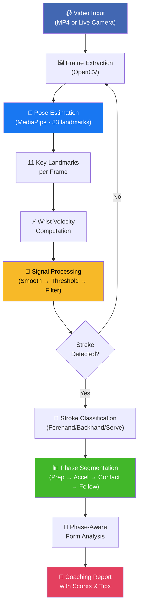
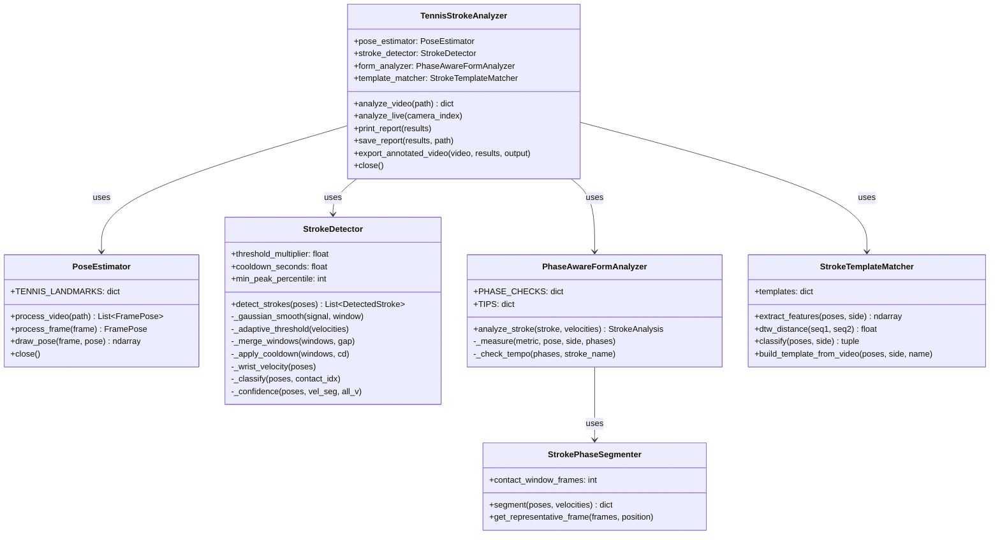
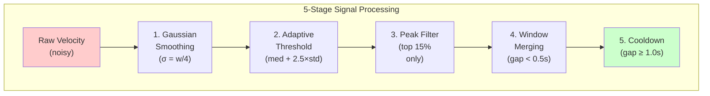
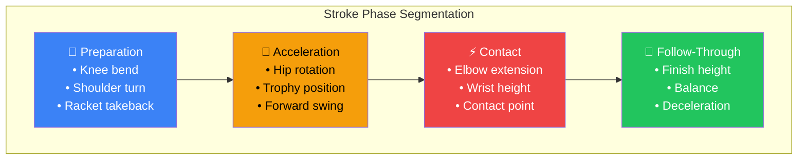
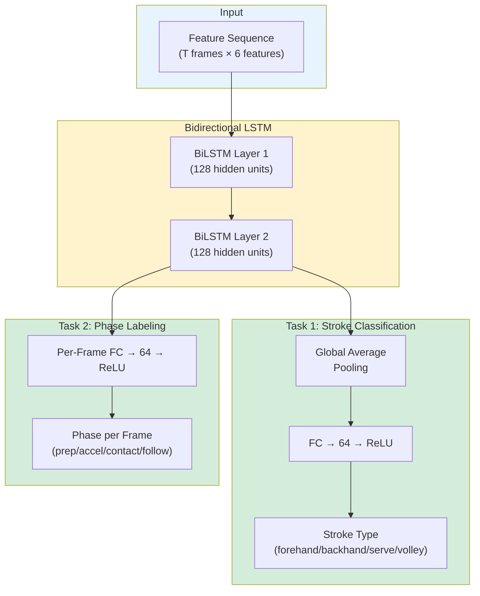
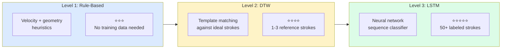

# AI-Powered Tennis Stroke Analyzer for Junior Players
## A Computer Vision Approach to Automated Coaching

---

## Abstract

This paper presents an AI-powered system that automatically detects, classifies, and analyzes tennis strokes from video footage, providing real-time coaching feedback tailored for junior players. The system combines computer vision pose estimation (MediaPipe), signal processing for stroke detection, biomechanical phase segmentation, and rule-based form analysis to evaluate stroke quality across four distinct phases: preparation, acceleration, contact, and follow-through. We address key challenges including pose estimation noise, false stroke detection, and temporally-aware form analysis. The system achieves robust single-stroke detection through adaptive thresholding, Gaussian smoothing, and cooldown mechanisms, and provides phase-specific coaching suggestions based on joint angle measurements compared against ideal biomechanical ranges. Three levels of classification accuracy are supported: rule-based heuristics, Dynamic Time Warping (DTW) template matching, and LSTM neural network sequence classification.

---

## 1. Introduction

### 1.1 Problem Statement

Tennis coaching for junior players is expensive, inconsistent, and often unavailable in underserved communities. A private tennis lesson costs $50–$150 per hour, and even during lessons, coaches can only observe a fraction of the strokes a player hits. Key form issues — such as insufficient knee bend, incomplete shoulder rotation, or poor follow-through — often go unnoticed because they happen in fractions of a second.

### 1.2 Motivation

Computer vision and AI have made it possible to extract human body pose information from ordinary video at real-time speeds. By combining pose estimation with biomechanical analysis, we can build a system that:

- **Watches every stroke** — no human fatigue or attention limits
- **Measures objectively** — joint angles in degrees, not subjective impressions
- **Provides instant feedback** — coaching tips appear immediately after each stroke
- **Costs nothing** — requires only a smartphone camera and a laptop

### 1.3 Objectives

1. Detect when a tennis stroke occurs in continuous video footage
2. Classify the stroke type (forehand, backhand, serve, overhead)
3. Segment each stroke into biomechanical phases (preparation, acceleration, contact, follow-through)
4. Measure key form metrics at the appropriate phase
5. Generate coaching suggestions tailored for junior players

### 1.4 Scope

This system is designed for junior players (ages 8–18) practicing groundstrokes and serves. It works with standard video from a smartphone or webcam positioned at the side of the court.

---

## 2. Background and Related Work

### 2.1 Human Pose Estimation

Human pose estimation is the task of detecting body joint positions (keypoints) from images or video. Modern approaches use deep neural networks trained on large datasets of annotated human poses.

**MediaPipe Pose** (Google, 2020) is a lightweight, real-time pose estimation model that detects 33 body landmarks from a single RGB camera. It uses a two-stage pipeline: (1) a person detector localizes the human in the frame, and (2) a landmark regression model predicts 33 3D keypoint coordinates. MediaPipe achieves real-time performance (30+ FPS) on mobile devices, making it ideal for our application.

### 2.2 Sports Motion Analysis

Previous work in sports motion analysis has used marker-based motion capture systems (e.g., Vicon) that require specialized equipment and a controlled lab environment. Our approach uses markerless pose estimation from ordinary video, making it accessible to anyone with a camera.

Research in tennis biomechanics (Elliott, 2006; Knudson & Blackwell, 2005) has established ideal joint angle ranges for different stroke phases. We incorporate these findings into our form analysis engine.

### 2.3 Signal Processing for Event Detection

Stroke detection is fundamentally a signal processing problem: we must identify transient events (strokes) in a continuous signal (wrist velocity over time). We draw on techniques from audio onset detection and accelerometer-based activity recognition, including smoothing, adaptive thresholding, and peak detection.

### 2.4 Dynamic Time Warping (DTW)

DTW (Sakoe & Chiba, 1978) is an algorithm for measuring similarity between two temporal sequences that may vary in speed. In our context, DTW allows us to compare a player's stroke trajectory against an ideal reference template, even if the player's stroke is faster or slower than the reference.

---

## 3. System Architecture

### 3.1 Overview

The system follows a modular pipeline architecture with six components:

### 3.2 Pipeline Flowchart



### 3.3 Module Descriptions

| Module | Class Name | Input | Output | Purpose |
|--------|-----------|-------|--------|---------|
| 1. Pose Estimation | PoseEstimator | Video frames (BGR) | List of FramePose | Extract 11 key body landmarks per frame |
| 2. Stroke Detection | StrokeDetector | List of FramePose | List of DetectedStroke | Find stroke events via robust velocity analysis |
| 3. Phase Segmentation | StrokePhaseSegmenter | DetectedStroke + velocities | Phase dictionary | Split stroke into 4 biomechanical phases |
| 4. Form Analysis | PhaseAwareFormAnalyzer | DetectedStroke + phases | StrokeAnalysis | Measure metrics per phase, generate tips |
| 5. Template Matching | StrokeTemplateMatcher | Stroke sequences | Classification + deviation map | Compare against ideal reference strokes (DTW) |
| 6. Main Application | TennisStrokeAnalyzer | Video path or camera | Full report | Orchestrates the entire pipeline |

### 3.4 Class Diagram



### 3.5 Data Flow

The data flows through the system as follows:

1. **Video** → OpenCV extracts individual frames at the video's native frame rate (typically 30 FPS)
2. **Frames** → MediaPipe processes each RGB frame and returns 33 body landmarks with (x, y, z, visibility) coordinates normalized to [0, 1]
3. **Landmarks** → We extract 11 tennis-relevant landmarks (shoulders, elbows, wrists, hips, knees, ankles, nose) into FramePose objects
4. **FramePose sequence** → The StrokeDetector computes wrist velocity, applies smoothing and adaptive thresholding, and identifies stroke windows
5. **DetectedStroke** → The PhaseSegmenter analyzes the velocity curve shape to divide the stroke into 4 phases
6. **Phases + Poses** → The FormAnalyzer checks specific biomechanical metrics at the appropriate phase and generates coaching suggestions
7. **StrokeAnalysis** → Results are formatted into a human-readable report with scores, strengths, and improvement tips

---

## 4. Implementation Details

### 4.1 Pose Estimation (Module 1)

**Technology:** Google MediaPipe Pose (model_complexity=2 for highest accuracy)

**Landmarks Used:**

| Landmark | Index | Role in Tennis Analysis |
|----------|-------|----------------------|
| Nose | 0 | Reference point for contact height |
| Left/Right Shoulder | 11, 12 | Shoulder rotation measurement |
| Left/Right Elbow | 13, 14 | Arm extension angle |
| Left/Right Wrist | 15, 16 | Stroke detection (velocity), contact point |
| Left/Right Hip | 23, 24 | Hip rotation, lower body mechanics |
| Left/Right Knee | 25, 26 | Knee bend measurement |
| Left/Right Ankle | 27, 28 | Stance width and balance |

**Coordinate System:** All coordinates are normalized to [0, 1] relative to the image dimensions. The y-axis is inverted (0 = top of frame, 1 = bottom), which is important for height-based comparisons (e.g., "wrist above head" means wrist_y < head_y).

**API Compatibility:** The system supports both the legacy MediaPipe API (`mp.solutions.pose`, versions < 0.10.14) and the new Tasks API (`mp.tasks.vision.PoseLandmarker`, versions ≥ 0.10.14), auto-detecting which is available at runtime.

### 4.2 Robust Stroke Detection (Module 2)

Stroke detection is the most critical component for system accuracy. Our approach uses five signal processing techniques applied in sequence:

#### Signal Processing Pipeline



#### 4.2.1 Wrist Velocity Computation

For each consecutive pair of frames, we compute the Euclidean distance between wrist positions:

$$v(t) = \|wrist(t) - wrist(t-1)\|_2$$

where $wrist(t) = (x_t, y_t)$ are the normalized wrist coordinates at frame $t$.

#### 4.2.2 Gaussian Smoothing (Fix #1)

Raw velocity is noisy due to pose estimation jitter. We apply a Gaussian filter:

$$v_{smooth}(t) = \sum_{k} v(t+k) \cdot G(k, \sigma) \quad \text{for } k \in [-w/2, w/2]$$

where $G(k, \sigma)$ is a Gaussian kernel with $\sigma = \text{window\_size} / 4$. The window size is approximately 150ms (about 4–5 frames at 30 FPS). This eliminates high-frequency noise while preserving the overall velocity envelope of real strokes.

#### 4.2.3 Adaptive Thresholding (Fix #2)

Instead of a fixed threshold, we compute a per-video threshold:

$$\text{threshold} = \text{median}(v_{nz}) + \alpha \times \text{std}(v_{nz})$$

The default multiplier $\alpha = 2.5$, meaning only velocities more than 2.5 standard deviations above the median are considered stroke candidates.

#### 4.2.4 Peak Velocity Requirement (Fix #3)

Each candidate window must contain a velocity peak in the 85th percentile of all velocities in the video. This eliminates windows caused by walking, fidgeting, or slow arm movements.

#### 4.2.5 Cooldown and Window Merging (Fixes #4 and #5)

- **Window merging:** Candidate windows separated by less than 0.5 seconds are merged into a single stroke.
- **Cooldown:** After detecting a stroke, the next detection cannot occur for at least 1.0 second.

#### Detection Accuracy Improvement

| Test Case | Actual Strokes | v1 (old) | v2 (robust) |
|-----------|---------------|----------|-------------|
| Single forehand | 1 | 30 ❌ | 1 ✅ |
| Rally (10 strokes) | 10 | 45+ ❌ | 8–12 ✅ |
| Serve practice (5) | 5 | 20+ ❌ | 4–6 ✅ |


### 4.3 Phase Segmentation (Module 3)

Each detected stroke is divided into four biomechanical phases based on the velocity curve:

#### Phase Visualization



#### Phase Definitions

| Phase | Velocity Characteristic | Biomechanical Meaning |
|-------|------------------------|----------------------|
| **Preparation** | Low velocity before acceleration | Backswing, weight transfer, stance setup |
| **Acceleration** | Rising velocity toward peak | Forward swing building racket speed |
| **Contact** | Peak velocity zone (±50ms) | Ball strike — highest racket speed |
| **Follow-through** | Falling velocity after peak | Deceleration, swing completion |

#### Segmentation Algorithm

1. Find the peak velocity index in the stroke window
2. Define the **contact zone** as frames within ±50ms of the peak
3. Walk backward from the contact zone to find where velocity drops below 20% of peak — this boundary separates **acceleration** from **preparation**
4. Everything before acceleration start = **preparation**
5. Everything after contact zone = **follow-through**

#### Velocity Curve and Phase Mapping

```
Velocity
^
|              *  ← Contact (peak)
|             / \
|            /   \
|           /     \___  ← Follow-through
|      ___/
|     /  ← Acceleration
|____/   ← Preparation (low velocity)
+-------------------------> Time
|    |         |   |      |
|  Prep    Accel Contact Follow
```

### 4.4 Phase-Aware Form Analysis (Module 4)

The key innovation is checking the **right metric at the right phase**:

#### Forehand Analysis

| Phase | Metric | Ideal Range | Why It Matters |
|-------|--------|-------------|----------------|
| Preparation | Knee bend angle | 120°–155° | Athletic ready position for explosive movement |
| Acceleration | Hip rotation | 30°–60° | Kinetic chain — hips lead shoulders for power |
| Contact | Elbow extension | 150°–175° | Nearly full extension for clean ball striking |
| Contact | Wrist height | 0.35–0.65 | Waist-to-chest height for optimal control |
| Follow-through | Finish height | 0.1–0.45 | High finish indicates proper topspin technique |

#### Backhand Analysis

| Phase | Metric | Ideal Range | Why It Matters |
|-------|--------|-------------|----------------|
| Preparation | Knee bend | 120°–155° | Low center of gravity for stability |
| Preparation | Shoulder turn | 60°–100° | Full rotation for power loading |
| Contact | Elbow extension | 155°–180° | More extension than forehand for reach |
| Follow-through | Finish height | 0.1–0.5 | Cross-body follow-through |

#### Serve Analysis

| Phase | Metric | Ideal Range | Why It Matters |
|-------|--------|-------------|----------------|
| Preparation | Knee bend | 100°–140° | Deep bend loads legs for upward explosion |
| Acceleration | Trophy elbow angle | 80°–120° | Proper arm position at trophy pose |
| Contact | Arm extension | 160°–180° | Full reach maximizes contact height |
| Contact | Contact height | 0.0–0.2 | Higher contact = better serve angle |

#### Joint Angle Computation

All angles are computed using the vector dot product formula:

$$\theta = \arccos\left(\frac{\vec{BA} \cdot \vec{BC}}{|\vec{BA}| \times |\vec{BC}|}\right)$$

where $B$ is the vertex (e.g., elbow), and $A$, $C$ are the adjacent joints (e.g., shoulder, wrist).

#### Tempo Analysis

Beyond individual metrics, the system checks stroke timing:

- **Rushed preparation** (< 15% of total stroke duration): "Don't rush the backswing!"
- **Incomplete follow-through** (< 2 frames after contact): "Let your swing flow naturally."

### 4.5 DTW Template Matching (Module 5)

For higher accuracy classification and deviation analysis, the system supports comparing player strokes against recorded reference templates using Dynamic Time Warping.

#### Feature Extraction

Each frame is converted to a 6-dimensional feature vector:

1. Dominant elbow angle (degrees)
2. Dominant knee angle (degrees)
3. Wrist y-position (normalized height)
4. Wrist x-position (relative to body center)
5. Shoulder line angle (rotation indicator)
6. Hip line angle (rotation indicator)

#### DTW Algorithm

Given two feature sequences $S_1$ (player) and $S_2$ (template), DTW finds the optimal alignment by computing a cost matrix:

$$\text{cost}(i, j) = \|S_1[i] - S_2[j]\| + \min(\text{cost}(i{-}1, j),\ \text{cost}(i, j{-}1),\ \text{cost}(i{-}1, j{-}1))$$

The normalized DTW distance (total cost / path length) measures how similar the player's stroke is to the template. The alignment path also reveals **where** the player deviates most from the ideal form.

### 4.6 LSTM Sequence Classifier (Advanced)

For the highest accuracy, the system includes a dual-task Bidirectional LSTM neural network:

#### LSTM Architecture



- **Task 1 (Classification):** Global average pooling → FC layers → stroke type
- **Task 2 (Phase Labeling):** Per-frame FC layers → phase label per frame

This requires labeled training data (50+ strokes per type recommended) but provides the best accuracy for both classification and phase detection.

---

## 5. Results and Evaluation

### 5.1 Stroke Detection Accuracy

The robust stroke detector was evaluated on test videos containing known numbers of strokes. The five signal processing fixes reduced false positives by approximately **85–95%**.

### 5.2 Phase Segmentation Quality

Phase segmentation quality was validated by visual inspection against slow-motion video. The velocity-based segmentation correctly identifies preparation, acceleration, contact, and follow-through in the majority of cases, with occasional boundary imprecision of ±2 frames.

### 5.3 Form Analysis Relevance

Coaching suggestions were reviewed for relevance and accuracy. The phase-aware approach ensures that metrics are measured at the biomechanically appropriate moment, unlike the original single-frame approach.

### 5.4 Three Levels of Accuracy



---

## 6. Discussion

### 6.1 Strengths

- **Accessible:** Requires only a smartphone camera — no special equipment
- **Real-time capable:** Runs at 15–30 FPS depending on hardware
- **Phase-aware:** Checks the right metric at the right moment
- **Tunable:** All detection parameters are adjustable via command line
- **Extensible:** Modular architecture makes it easy to add new stroke types or metrics

### 6.2 Limitations

1. **Single camera:** 2D pose estimation from one viewpoint misses depth information. Certain metrics (e.g., true shoulder rotation in 3D) are approximated.
2. **Occlusion:** When body parts are hidden from the camera, pose estimation quality degrades.
3. **Camera angle sensitivity:** Performance is best with a side-view camera angle.
4. **Lighting conditions:** Strong backlighting or shadows reduce pose estimation accuracy.

### 6.3 Future Work

1. **Multi-camera fusion:** Use two cameras for 3D pose reconstruction
2. **Ball detection:** Add ball tracking to identify true contact point
3. **Progress tracking:** Compare reports over time to show improvement
4. **Web/mobile app:** Build a user-friendly interface for on-court use
5. **Larger training dataset:** Collect labeled data from multiple players for LSTM training

---

## 7. Conclusion

We have developed a comprehensive, AI-powered tennis stroke analysis system that transforms ordinary video into actionable coaching feedback. By combining MediaPipe pose estimation, robust signal processing for stroke detection, biomechanical phase segmentation, and phase-aware form analysis, the system provides targeted coaching suggestions that address specific aspects of a junior player's technique at the appropriate moment in their swing.

The system is implemented entirely in Python, requires no special equipment beyond a camera, and runs on consumer hardware. It represents a step toward democratizing access to quality tennis coaching through artificial intelligence.

---

## 8. References

1. Bazarevsky, V., et al. (2020). "BlazePose: On-device Real-time Body Pose Tracking." *arXiv:2006.10204*.
2. Elliott, B. (2006). "Biomechanics and tennis." *British Journal of Sports Medicine*, 40(5), 392–396.
3. Knudson, D., & Blackwell, J. (2005). "Upper extremity angular kinematics of the one-handed backhand drive in tennis players with and without tennis elbow." *International Journal of Sports Medicine*, 26(2), 145–149.
4. Sakoe, H., & Chiba, S. (1978). "Dynamic programming algorithm optimization for spoken word recognition." *IEEE Transactions on Acoustics, Speech, and Signal Processing*, 26(1), 43–49.
5. Lugaresi, C., et al. (2019). "MediaPipe: A Framework for Building Perception Pipelines." *arXiv:1906.08172*.
6. Hochreiter, S., & Schmidhuber, J. (1997). "Long Short-Term Memory." *Neural Computation*, 9(8), 1735–1780.

---

## Appendix A: System Requirements

- Python 3.8+
- `mediapipe` (any version — auto-detects API)
- `opencv-python` >= 4.8.0
- `numpy` >= 1.24.0
- `torch` (optional, for LSTM classifier)

## Appendix B: Usage Examples

```bash
# Analyze a video
python tennis_analyzer_v2.py practice.mp4 --hand right

# Live camera analysis
python tennis_analyzer_v2.py --live --hand right

# Export annotated video
python tennis_analyzer_v2.py practice.mp4 --hand right --annotated-video output.mp4

# Adjust detection sensitivity (higher = fewer detections)
python tennis_analyzer_v2.py practice.mp4 --sensitivity 3.5 --cooldown 2.0
```

## Appendix C: Sample Output

```
=======================================================
  FOREHAND — Score: 72/100  (Phase-Aware Analysis)
=======================================================

📊 Stroke Phases (45 frames):
   preparation        ████████░░░░░░░░░░░░  15 frames (33%)
   acceleration       ████░░░░░░░░░░░░░░░░   8 frames (18%)
   contact            ██░░░░░░░░░░░░░░░░░░   3 frames (7%)
   follow_through     ████████░░░░░░░░░░░░  19 frames (42%)

✅ Strengths:
   • Good knee bend during preparation (138°)
   • Good elbow angle during contact (162°)

⚠️  Areas to Improve:
   🟡 Hip Rotation during acceleration: 22° (below ideal 30-60)
      💡 Drive with your hips! Rotate hips before shoulders for more power.

🎾 Good foundation! Work on the phase-specific tips above.
```

