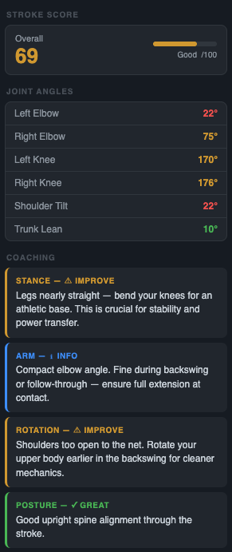

# AI-Powered Tennis Stroke Analyzer for Junior Players
## A Computer Vision Approach to Automated Coaching

## — 5/28/26 —
### Achievements (initial framework setup)
- I set up a simple website with initial features including video file upload and basic playback functions. Strokes are detected, analyzed, and scored, with feedback appearing in a side panel.
- **Firebase** authentication allows users to log in and store uploaded files. A detailed instruction page to set up Firebase appears for first-time users.

- **MediaPipe Pose** is used for body detection and to draw a skeleton over the player’s body in the video.
  - MediaPipe Pose is a machine learning model from Google that detects a person's body in a video frame and outputs 33 landmarks (shoulders, elbows, wrists, hips, knees, ankles, etc.). Each landmark has x/y coordinates and a visibility score. They are used to calculate wrist speed (normalized using shoulder width) and joint angles (elbow angle, knee bend, shoulder tilt, and trunk lean).
- **COCO-SSD** is used to detect the racquet. This model is run every 20 frames and draws a bounding box around the racquet when it detects it with confidence > 60%.
  - COCO-SSD (Common Objects in Context Single Shot MultiBox Detector) is an object detection model trained on 80 everyday object categories (including "tennis racket").
- I chose an initial set of measurements, taken from the Mediapipe Pose landmarks, that are used to score the stroke. Each metric contributes a number of points toward 100 based on how close the measured angle is to the ideal range (inside: 100, +- 15%: 55, outside: 12).
  - Elbow angle: taken from the right arm, ideally from 95 to 158 degrees, weight of 30.
  - Knee bend: averaged from the right and left legs, should be 115 to 155 degrees, weight of 30
  - Shoulder tilt: the angle the shoulder line makes with the horizontal, should be from 0 to 10 degrees, weight of 20.
  - Trunk lean: the angle between the line joining the shoulder midpoint to the hip midpoint and the vertical, ideally 0 to 13 degrees, weight of 20.
- I wrote a default set of feedback that is connected to the measurements.

| Arm (elbow) | Stance (knee bend) | Rotation (shoulder tilt) | Posture (trunk lean) |
| --- | --- | --- | --- |
| 162°: warn — arm too straight | 168°: warn — legs nearly straight | < 7°: good — well rotated | ≤ 11°: good — upright alignment |
| 100°–162°: good — natural bend | 152°–168°: warn — bend more | 7°–16°: info — moderate rotation | 11°–23°: info — slight lean, monitor balance |
| 65°–100°: info — compact, fine during backswing | 115°–152°: good — solid athletic position | 16°: warn — shoulders too open | 23°: warn — significant lean |
| < 65°: warn — too bent, not extending through ball | < 115°: info — very deep, check mobility |

### Issues
- The body landmark detection is unstable, causing the angles to be inaccurate. 
- Racquet detection is unreliable. This causes stroke detection to be wrong, with a single stroke sometimes having multiple scores.
- The measurements have many limitations. For example, the angles are averaged throughout the entire swing, which includes preparation and follow-through, making the feedback less accurate. The feedback also doesn’t distinguish between different types of strokes, which may require different mechanics and ranges.
