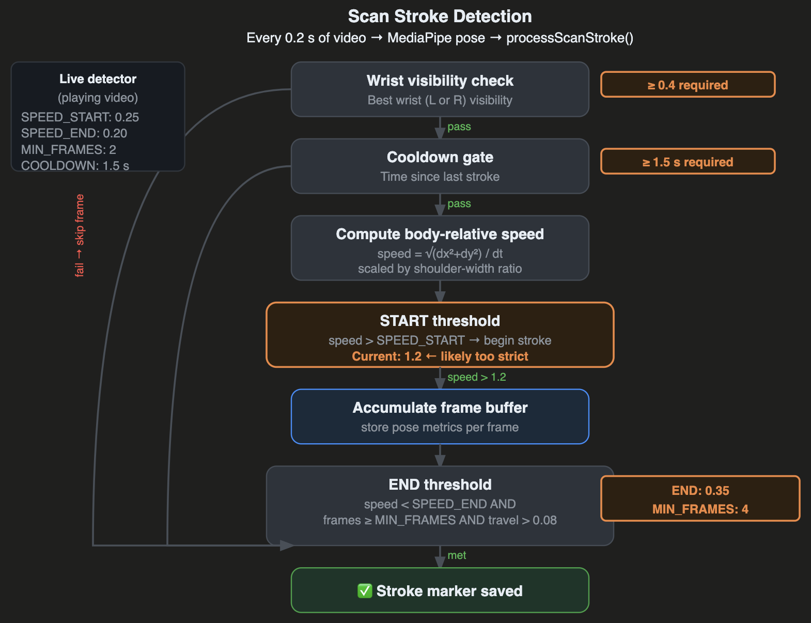
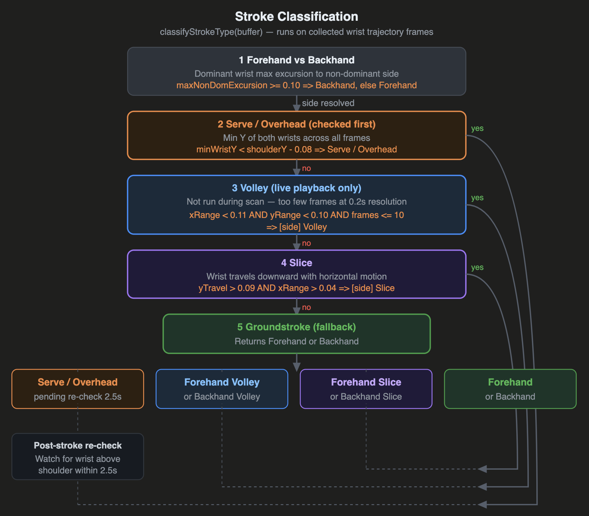
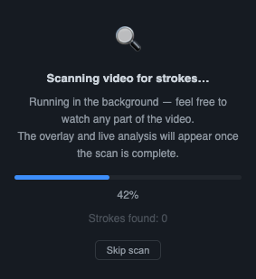
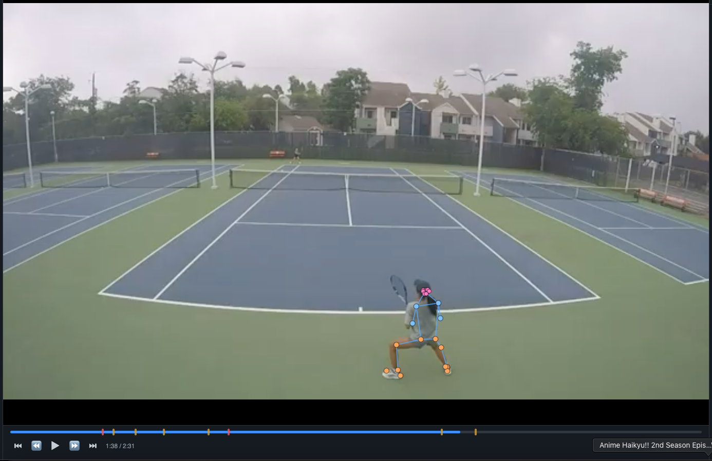

# AI-Powered Tennis Stroke Analyzer for Junior Players
## A Computer Vision Approach to Automated Coaching

## — 6/20/26 —
### Achievements
#### Algorithm modifications:
- Ball detection
  - Initially used HSV color thresholds (yellow/green), which was too strict and didn’t detect the ball.
  - Switched to RGB thresholds:
    - g > 180 && g > r + 20 && g > b + 20 && r > 120 (still too strict)
    - g > 160 && g > r + 10 && g > b + 10 && r > 80 (false positives on green tennis court surface)
    - g > 170 && g > r + 12 && g > b + 12 && r > 100 (started triggering on edges of white court lines)
  - Switched to detecting through motion, scanning for groups of pixels that change color rapidly in consecutive frames. Large areas of motion are ignored, and the area surrounding the body landmarks (player) is ignored. 
  - Motion detection was very unreliable and confused the opponent’s movement with the ball. I tried to block out the opponent’s movement by ignoring areas that experience constant motion lasting past the amount of time a ball would take to travel through the area, but the opponent is constantly moving, so still detected.
  - The ball has a maximum velocity and must travel in a continuous path. I attempted to simplify the detector by only checking the region surrounding the ball’s last detected position for new motion. However, false positives cause this region to expand and the change becomes ineffective.
  - Switched to a combination of motion and color. First detect areas that experience two rapid color changes (original -> ball -> original again), with the middle color falling in the yellow/green range. Continue to ignore large groups of pixels and set a maximum velocity on the ball movement, preventing random jumps from one point on the screen to another.
  - When the ball travels through shadow or over the blue/green court, its color changes from bright yellow to light blue/green or even a dark grey. I dropped the tennis ball color check and just checked each pixel for two consecutive color changes, with the initial and final color being similar.
  - Going back to continuity, a pixel that experiences motion can only be considered as a possible ball if there was motion in the surrounding area in the previous few frames. This slightly reduced the number of false positives that appeared on the edges of the video.

#### Feature improvements:
- Initially toast notifications appeared above the video whenever a ball was detected, but quickly stacked up and blocked the video. I changed the indicator to a constant label on the bottom, next to the playback speed dropdown, that turns green when a ball is detected.
- To help with debugging the newly added ball detector, every 3 frames a blue circle is drawn over the video wherever a tennis ball is detected, tracing the ball’s path. An HUD display showed the RGB values of any pixel that is hovered over, as well as the number of pixels that experience motion (color change).
- Whenever a new video file is opened, the feedback side panel starts out blank until the user watches the first stroke. Previously, it would show feedback on a stroke from the scan before the user even watched the video.

### Issues
- Whenever the video file is switched while the video is playing, the play/pause button and playback speed don’t reset. The button shows unpaused, and the speed dropdown shows the most recently selected speed even though the video plays at 1x speed.

## — 6/16/26 —
### Achievements
#### Algorithm modifications:

- Stroke detection
  - Start speed: 1.2 -> 0.65
  - End speed: 0.35 -> 0.25
  - Min number of frames: 4 -> 3
  - Required wrist visibility: 0.4 -> 0.3
  - Swing travel distance: 0.08 -> 0.05

#### Feature improvements:
- Sometimes the body landmark detector mistakenly places dots, causing unrealistic angle measurements that result in extremely low stroke scores. To avoid this, I defined plausible bounds for each angle measurement. When the measured angle exceeds this, there will be a warning (“Possibly inaccurate”) and the measurement will have a decreased weight in the score calculation.
  - Elbow: 15°–180°
  - Knee: 70°–185°
  - Shoulder tilt: 0°–60°
  - Trunk lean: 0°–45°
- The plausible bounds can help in a lot of cases, but when the player’s body is completely incorrectly detected (for example, shoulders are above head) the score will be inaccurate. I added a warning (similar to the out of frame warning) that tells the user detection and analysis may be inaccurate when basic anatomical ordering (nose, shoulders, hips, knees, ankles) goes out of order. If this warning triggers during a stroke, the stroke’s score will have a small indicator.
- I incorporated a tennis ball detector that can be helpful in identifying strokes (when the ball changes direction) and body orientation. However, with unclear files the ball is sometimes hard to detect, and the algorithm needs to be adjusted for serves, when the direction change is less extreme. 

### Issues
- Feedback updates can be triggered by both the detector (when speed drops) and when the stroke ends (end time + 0.2), sometimes causing the feedback panel to update multiple times while a single stroke is being hit.
- When the camera angle is from the side, and the player’s shoulders are square, the detector can’t tell if the player is facing towards or away from the camera. This makes it unable to differentiate forehands from backhands.

## — 6/11/26 —
### Achievements
#### Algorithm modifications:
- Stroke end time calculation
  - Initial algorithm: stroke start time + 1 s (assumes constant swing length for all types of strokes)
  - Improved: stroke end time + 0.2 s
- Continue working on stroke classification
  - In a serve, the wrist speed drops as the player reaches trophy position, causing the detector to end the stroke. The wrist never gets above the shoulder and the stroke is never classified as a serve/overhead. I added a pending serve check watch to see if the wrist goes above the shoulder in the next 2.5 seconds after a stroke ends.
  - When the player’s body is turned to the side, so that the shoulders are perpendicular to the camera, a large racquet takeback can cross to the opposite side of the body, causing misclassification between forehands and backhands. Changed to find the wrist’s position at its maximum horizontal distance from the shoulder midpoint and see which side of the body it’s on.

#### Feature improvements:
- A Rescan option, for when the background scan has already been conducted, to implement new algorithm updates.
- Undo button at the bottom of the score panel in case a stroke is mistakenly deleted.
- When the player’s body leaves the frame or is too far away, and the detector can’t find the body landmarks, I added a warning that tells the user that no player is detected and pauses the video. There is an option to continue watching the video or skip ahead to when the player returns to the frame. This warning initially covered the entire score panel, I later changed it to be a popup bar at the bottom of the panel that doesn’t pause the video. The player can choose to dismiss the warning or skip ahead to the next visible time.
- A right/left-handedness switch that flips forehand/backhand classification for left-handed players.
- I’ve been using GoPro footage of a tennis match to test the analyzer, but the camera angle and video quality are not high. Sometimes the player moves out of frame, or far away from the camera, making it difficult to detect body landmarks. In order to test and finetune the analyzer more easily, I filmed closeup videos of myself performing simple strokes with good and bad technique.

### Issues
- When the initial background scan is skipped, there is a bug that causes the Auto-pause feature to not work even when the user has selected it.
- When the dominant wrist becomes less visible (like when blocked by the player’s body), the detector switches to using the non-dominant wrist, resulting in inaccurate analysis.
- The detector “starts” a stroke when the wrist speed reaches a threshold, but this often excludes the slower preparation/takeback in a swing. This was improved by maintaining a 2 second wrist history. When the wrist speed increases, the history is searched for the time when the arm was at neutral position (wrist aligned with shoulder) and uses that as the start time.
- Similarly, the stroke ends early when the follow-through is slow. To fix this, the stroke only ends when the wrist has traveled a certain distance after the wrist speed drops below the stroke threshold.

## — 6/4/2026 —
### Achievements
#### Algorithm modifications:

- Try to make stroke classification more accurate
  - The scan only looks at a few frames of the serve, detecting a small range, which classifies as volley.
  - Forehand/backhand distinction was incorrectly comparing the wrist position to hips, causing almost all strokes to classify as forehand.

#### Feature improvements:
- I moved the scan to the background so the user doesn’t have to wait for the scan to complete. There is a scan progress bar and a stroke counter. The user can freely use the playback tools to watch the video. 
- I stored the stroke markers (on the progress bar) in Firestore so the user doesn’t have to rescan after opening the website again.
- I removed the angle numbers from the video screen because they overlapped and were unreadable. The only thing that appears on the video screen are dots, for body landmarks, and connecting lines for limbs.
- I added an Auto-pause feature, which if selected pauses the video whenever a stroke finishes so the user can read the analysis and feedback. Once done, the user can click “Continue” and the video unpauses until the next stroke is finished. If the analyzer incorrectly detects a stroke, the user can select “Not a stroke” and the marker disappears.

### Issues
- The stroke counter remained at 0 throughout the entire scan. This was fixed after adjusting the stroke detection requirements (wrist speed threshold).

- The timing of the pause had to be adjusted because the detector tends to stop the stroke right after the ball is hit, before the follow-through is over.
- The background scan adds markers to the progress bar, but watching the video after the scan continues to add new markers. This is due to different frames being sampled, causing different detected stroke start times and scores. I changed the background scan to only detect strokes, adding grey markers, while the real-time playback assigned scores to the markers. This was unreliable because new strokes were still being detected. I switched back to having the background scan detect strokes and assign scores, storing these in the scan buffer. The real-time playback takes scores and feedback directly from the buffer.
- Sometimes the stroke analysis panel doesn’t update quickly enough, and it would skip a few strokes if they were close together. Fixed to update whenever a new stroke starts.

## — 5/31/2026 —
### Achievements (more advanced features)

- While the analyzer scans through the video, small tick marks appear on the video progress bar to show detected strokes. The marks are colored green, yellow, or red according to the stroke’s score. The user can click on a mark to watch the associated stroke.
- A background scan plays the video at 4x speed and samples frames at regular intervals, so the user doesn’t have to watch the entire video for the analyzer to finish. There is also a Skip Scan option that allows the user to watch the video and see feedback appear in real time.
- A stroke classification feature categorizes each stroke as forehand or backhand groundstroke/volley/slice or serve/overhead.

### Issues
- Detection is still inaccurate so the marks don’t line up with actual strokes, there are much more marks than strokes.
- Almost every stroke is being classified as a forehand volley.

## — 5/28/26 —
### Achievements (initial framework setup)
- I set up a simple website with initial features including video file upload and basic playback functions. Strokes are detected, analyzed, and scored, with feedback appearing in a side panel.
- **Firebase** authentication allows users to log in and store uploaded files. A detailed instruction page to set up Firebase appears for first-time users.

- **MediaPipe Pose** is used for body detection and to draw a skeleton over the player’s body in the video.
  - MediaPipe Pose is a machine learning model from Google that detects a person's body in a video frame and outputs 33 landmarks (shoulders, elbows, wrists, hips, knees, ankles, etc.). Each landmark has x/y coordinates and a visibility score. They are used to calculate wrist speed (normalized using shoulder width) and joint angles (elbow angle, knee bend, shoulder tilt, and trunk lean).
- **COCO-SSD** is used to detect the racquet. This model is run every 20 frames and draws a bounding box around the racquet when it detects it with confidence > 60%.
  - COCO-SSD (Common Objects in Context Single Shot MultiBox Detector) is an object detection model trained on 80 everyday object categories (including "tennis racket").
- I chose an initial set of measurements, taken from the Mediapipe Pose landmarks, that are used to score the stroke. Each metric contributes a number of points toward 100 based on how close the measured angle is to the ideal range (inside: 100, +- 15%: 55, outside: 12).
  - Elbow angle: taken from the right arm, ideally from 95 to 158 degrees, weight of 30.
  - Knee bend: averaged from the right and left legs, should be 115 to 155 degrees, weight of 30
  - Shoulder tilt: the angle the shoulder line makes with the horizontal, should be from 0 to 10 degrees, weight of 20.
  - Trunk lean: the angle between the line joining the shoulder midpoint to the hip midpoint and the vertical, ideally 0 to 13 degrees, weight of 20.
- I wrote a default set of feedback that is connected to the measurements.

| Arm (elbow) | Stance (knee bend) | Rotation (shoulder tilt) | Posture (trunk lean) |
| --- | --- | --- | --- |
| 162°: warn — arm too straight | 168°: warn — legs nearly straight | < 7°: good — well rotated | ≤ 11°: good — upright alignment |
| 100°–162°: good — natural bend | 152°–168°: warn — bend more | 7°–16°: info — moderate rotation | 11°–23°: info — slight lean, monitor balance |
| 65°–100°: info — compact, fine during backswing | 115°–152°: good — solid athletic position | 16°: warn — shoulders too open | 23°: warn — significant lean |
| < 65°: warn — too bent, not extending through ball | < 115°: info — very deep, check mobility |

### Issues
- The body landmark detection is unstable, causing the angles to be inaccurate. 
- Racquet detection is unreliable. This causes stroke detection to be wrong, with a single stroke sometimes having multiple scores.
- The measurements have many limitations. For example, the angles are averaged throughout the entire swing, which includes preparation and follow-through, making the feedback less accurate. The feedback also doesn’t distinguish between different types of strokes, which may require different mechanics and ranges.
